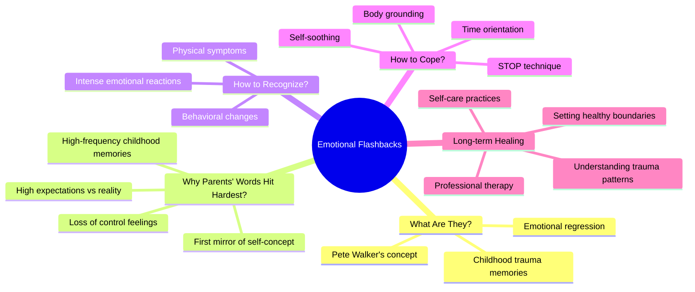

# Emotional Flashbacks: Why Parents' Words Trigger Our Strongest Reactions

## Mind Map

## Introduction

Have you ever experienced this: the same comment from a friend or colleague barely registers, but when it comes from your parents, you instantly "explode" with intense emotional reactions? Many attribute this to "generation gaps" or "bad temper," but psychology reveals the true cause lies in a deeper psychological mechanism—**emotional flashbacks**.

## What Are Emotional Flashbacks?

### Definition and Concept

**Emotional flashbacks** are a crucial concept introduced by psychologist Pete Walker. They refer to how seemingly ordinary present-moment scenarios can instantly awaken traumatic memories from our childhood, causing our emotions to automatically regress back to that helpless, invalidated version of ourselves.

### The Mechanism of Emotional Flashbacks

When parents say: "How can you be so careless again?"

What our brain hears isn't just this present moment statement, but countless accumulated memories of childhood criticism and invalidation. **Our emotions aren't responding to the present—they're responding to the past.**

As stated in "The Body Keeps the Score": "Past trauma doesn't disappear; it reappears through emotional flashbacks in similar situations."

## Why Do Parents' Words Most Easily Trigger Emotional Flashbacks?

Parents' words are most likely to trigger emotional flashbacks not because they are harsher than others, but because they carry our earliest emotional memories, deepest attachment patterns, and strongest expectation projections.

### 1. Parents as "The First Mirror"

#### Formation of Self-Concept
Before we developed a sense of self, our parents' words served as the first mirror through which we understood ourselves. Their childhood evaluations almost directly determined our understanding of fundamental questions:
- "Am I a good child?"
- "Am I worthy of love?"
- "Do I have value?"

#### Lasting Influence
Even as adults, parents' words retain powerful penetrating force, easily hitting our most vulnerable inner spots. This is because these early evaluations have become deeply embedded in our self-perception systems.

### 2. High-Frequency Childhood Emotional Memories

#### Memory Binding Effects
Parents are the people who accompany us longest in life, and most of our childhood emotional experiences are related to them:
- Joy when praised
- Fear when scolded
- Disappointment when ignored
- Warmth when cared for

#### Neural Pathway Reinforcement
These high-frequency emotional experiences form reinforced neural pathways in the brain. Parents' words naturally carry strong memory traces, making them more likely to activate the "emotional flashback" mechanism.

### 3. Parents' Words Touch on "Sense of Control"

#### Childhood Loss of Autonomy
Many people lacked sufficient autonomy with their parents from an early age, frequently experiencing:
- Choices being denied
- Opinions being ignored
- Behavior being over-controlled
- Emotions being suppressed

#### Adult Defensive Reactions
When parents continue to criticize or over-intervene in adulthood, the brain mistakenly thinks: "I'm going to be controlled again, I'm going to lose my freedom again." It immediately enters defensive mode, and emotions are instantly ignited.

### 4. The Contrast Between Expectations and Disappointment

#### Highest Expectations
We have higher expectations for our parents than for anyone else:
- Longing for them to understand our thoughts
- Hoping they will accept our choices
- Expecting them to support our decisions
- Wanting them to recognize our value

#### Reality Gap
However, reality often is:
- Parents always express care in their own way
- Care often comes mixed with criticism and worry
- Their way of expressing may make us feel misunderstood

This contradiction of "the person I most want to understand me is the one who hurts me most easily" intensifies the emotional reaction.

## Psychological Mechanisms of Emotional Flashbacks

### Characteristics of Traumatic Memory

#### 1. Body Memory
Traumatic memories are stored not only in the brain but also in the body. When triggers appear, the body automatically produces the physiological responses from that time:
- Accelerated heartbeat
- Muscle tension
- Rapid breathing
- Elevated blood pressure

#### 2. Time Displacement
In emotional flashbacks, the boundaries between past and present become blurred. Our emotional reaction intensity is often disproportionate to the current situation because we are actually responding to past trauma.

#### 3. Automatic Response
Emotional flashbacks are an automatic psychological defense mechanism that bypasses rational thinking and directly activates emotional and behavioral responses.

### Attachment Theory Perspective

#### Internal Working Models
According to John Bowlby's attachment theory, we form "internal working models" through interactions with primary caregivers (usually parents) during childhood. These models include:
- Views of self (Am I worthy of love?)
- Views of others (Are others reliable?)
- Expectations of relationships (Are relationships safe or dangerous?)

#### Model Activation
When parents' words touch these core models, they activate corresponding emotional and behavioral responses, even when we rationally know the current situation is different from the past.

## How to Identify and Cope with Emotional Flashbacks?

### Identifying Signals of Emotional Flashbacks

#### Emotional Signals
- Emotional reactions too intense, disproportionate to current situation
- Sudden feelings of anger, fear, shame, or despair
- Feeling like you've "returned to childhood"
- Experiencing "all-or-nothing" extreme thinking

#### Physical Signals
- Accelerated heartbeat or chest tightness
- Muscle tension or trembling
- Difficulty breathing or hyperventilation
- Dizziness or nausea

#### Behavioral Signals
- Wanting to escape or attack
- Language becoming intense or childish
- Inability to engage in rational dialogue
- Repeating childhood behavioral patterns

### Strategies for Coping with Emotional Flashbacks

#### 1. Pause and Awareness

**STOP Technique**:
- **S (Stop)**: Stop the current reaction
- **T (Take a breath)**: Take deep breaths
- **O (Observe)**: Observe your emotions and physical sensations
- **P (Proceed)**: Choose a more appropriate response

#### 2. Time Orientation

Remind yourself:
- "I am an adult now, not that helpless child"
- "This is 2025, not my childhood"
- "I now have the ability to protect myself"
- "I can choose how to respond"

#### 3. Body Regulation

**Grounding Techniques**:
- Feel the contact between your feet and the ground
- Touch objects around you with your hands
- Practice deep breathing exercises
- Do simple physical movements

#### 4. Self-Soothing

**Internal Dialogue**:
- "I understand how you feel right now"
- "This reaction is normal"
- "You are safe"
- "I will protect you"

### Long-term Healing Strategies

#### 1. Trauma-Informed Self-Understanding

Learn to understand your trauma patterns:
- Identify personal triggers
- Understand the roots of emotional reactions
- Cultivate self-compassion
- Accept that healing is a process

#### 2. Reconstructing Childhood Narratives

**Narrative Therapy Methods**:
- Re-examine childhood experiences
- Identify your resilience and strength
- Redefine yourself from "victim" to "survivor"
- Give new meaning to your story

#### 3. Establishing Healthy Boundaries

**In relationships with parents**:
- Clarify your bottom lines
- Learn to say "no"
- Choose appropriate communication methods
- Seek professional help when necessary

#### 4. Cultivating Self-Care

**Daily Practices**:
- Regular self-check-ins
- Develop self-soothing skills
- Build supportive interpersonal relationships
- Engage in meaningful activities

## Practical Communication Tips with Parents

### Preventive Strategies

#### 1. Setting Psychological Expectations
- Prepare mentally before communicating with parents
- Remind yourself of potential triggering situations
- Have coping strategies ready

#### 2. Choosing Appropriate Timing and Environment
- Avoid important conversations when tired or stressed
- Choose a relatively relaxed environment
- Ensure sufficient time and space

### Communication Techniques

#### 1. Using "I" Statements
- "I feel..." instead of "You always..."
- "I need..." instead of "You should..."
- "I hope..." instead of "You must..."

#### 2. Setting Boundaries
- Clearly express your needs and limits
- Stand your ground while maintaining respect
- Pause the conversation when necessary

#### 3. Finding Common Ground
- Acknowledge parents' care and love
- Look for solutions both parties can accept
- Focus on long-term relationship development

## The Importance of Professional Help

### When to Seek Professional Help

If emotional flashbacks seriously affect daily life, consider seeking professional help:
- Emotional reactions are too frequent or intense
- Impact on work or interpersonal relationships
- Symptoms of depression or anxiety appear
- Self-regulation strategies have limited effectiveness

### Effective Treatment Methods

#### 1. Trauma-Informed Therapy
- **EMDR (Eye Movement Desensitization and Reprocessing)**: Helps process traumatic memories
- **Somatic Therapy**: Releases trauma through body work
- **Internal Family Systems Therapy**: Integrates different internal parts

#### 2. Cognitive Behavioral Therapy
- Identify and change negative thought patterns
- Learn healthy coping strategies
- Develop emotional regulation skills

#### 3. Family Therapy
- Improve family communication patterns
- Address issues within the family system
- Build healthier family relationships

## Conclusion: Understanding and Healing

Emotional flashbacks are a universal psychological phenomenon that reminds us how past experiences continue to influence our present. Understanding the mechanisms of emotional flashbacks is not about blaming parents or wallowing in past pain, but rather to:

### Gain Self-Understanding
- Understand the roots of your emotional reactions
- Develop compassion for your own responses
- Recognize the validity of these reactions

### Gain the Power of Choice
- No longer be automatically controlled by past patterns
- Consciously choose how to respond
- Establish healthier interpersonal relationship patterns

### Promote Relationship Repair
- Build more mature relationships with parents
- Break negative intergenerational transmission patterns
- Create better growth environments for the next generation

**Remember**: Emotional flashbacks are not our fault, but healing them is our responsibility. Through understanding, acceptance, and positive action, we can gradually emerge from the shadows of the past and build healthier, freer lives.

Healing is a process that requires time, patience, and courage. But every time we choose understanding over reaction, compassion over blame, growth over stagnation, we are creating a better future for ourselves and those we love.